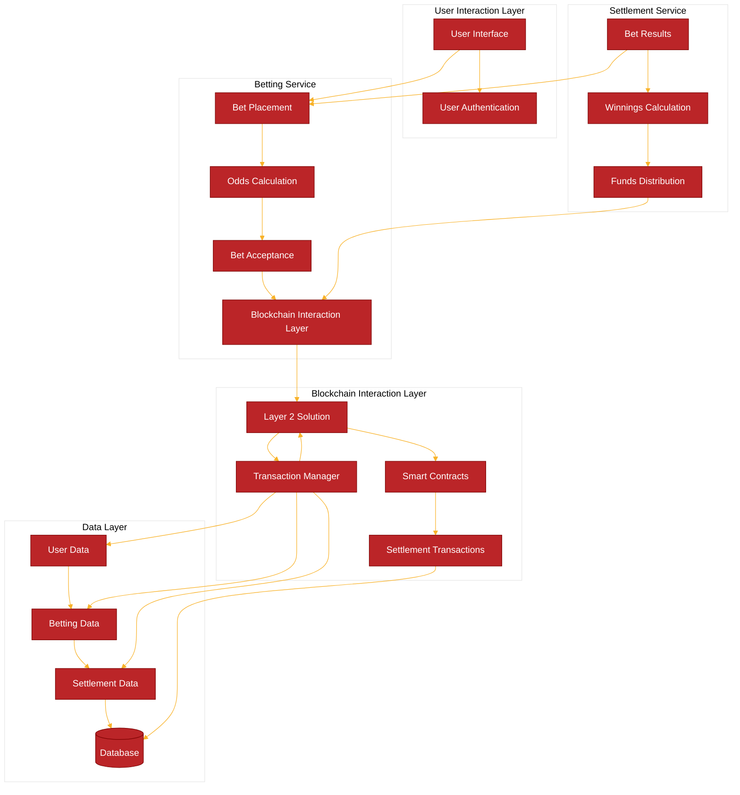

# Real-Time Betting and Settlement on L2 Solution

## Overview

The real-time betting and settlement system on a Layer 2 (L2) blockchain solution leverages the benefits of L2 scalability, speed, and lower transaction costs while ensuring the security and finality provided by the Layer 1 (L1) blockchain. The system is designed to handle high throughput, low latency, and secure transactions for betting and settlements.

## Architectural Design Diagramm


```plaintext
+------------------+        +------------------+        +------------------+
|  Web/Mobile UI   | <----> |   API Gateway    | <----> | Backend Services |
+------------------+        +------------------+        +------------------+
     |                                |                       |
     v                                v                       v
+-----------+   +-----------+   +-----------+   +-----------+   +-----------+
| Bet Mgmt  |   | Settlement|   | User Mgmt |   |  Oracle   |   | Analytics |
|  Service  |   |  Service  |   |  Service  |   |  Service  |   |  Service  |
+-----------+   +-----------+   +-----------+   +-----------+   +-----------+
     |                                |                       |
     v                                v                       v
+-----------------------------------------------------------+
|                     Layer 2 Blockchain                    |
|      (Smart Contracts, Rollup/Sidechain Mechanisms)       |
+-----------------------------------------------------------+
     |                                |
     v                                v
+-----------------------------------------------------------+
|                     Layer 1 Blockchain                    |
|                 (Mainnet for Finality)                    |
+-----------------------------------------------------------+
     |                                |
     v                                v
+-----------+   +-----------+   +-----------+   +-----------+
| Relational|   |   NoSQL   |   |  Security |   | Compliance|
| Database  |   |  Database |   |  & Auth   |   |  Module   |
+-----------+   +-----------+   +-----------+   +-----------+
```




## Components

### User Interface (UI)

- **Web and Mobile Applications**
  - **Frameworks**: Use modern frameworks such as React or Angular for web and Flutter or React Native for mobile applications.
  - **Features**:
    - User registration and login
    - Bet placement and history
    - Real-time odds and status updates
    - User notifications for bet outcomes

### API Gateway

- **Technology**: Implement using API Gateway services like AWS API Gateway or Kong.
- **Functions**:
  - **RESTful APIs**: For handling HTTP requests from the UI.
  - **WebSocket**: For real-time communication.
  - **Rate Limiting and Security**: Apply rate limiting, API key validation, and other security measures.

### Backend Services

- **Bet Management Service**
  - **Technology**: Develop using Golang.
  - **Functions**:
    - Validate and process bet placements.
    - Calculate and update betting odds.
    - Track bet status and outcomes.
    - Communicate with the Settlement Service for payouts.

- **Settlement Service**
  - **Technology**: Develop using Golang.
  - **Functions**:
    - Handle the settlement of bets based on outcomes.
    - Ensure correct payout calculations.
    - Update user balances.
    - Record transactions on the L2 blockchain.

- **User Management Service**
  - **Technology**: Develop using Golang.
  - **Functions**:
    - Manage user profiles and account settings.
    - Authenticate users using JWT, OAuth, or similar mechanisms.
    - Handle user authorization for accessing different parts of the system.

### Layer 2 Solution (L2)

- **Smart Contracts**
  - **Language**: Write using Solidity or Vyper.
  - **Functions**:
    - Manage bet placements and stakes.
    - Record bets and outcomes.
    - Ensure transparent and verifiable transactions.
    - Handle disputes and edge cases.

- **Rollup or Sidechain**
  - **Technology**: Choose between Optimistic Rollup, zk-Rollup, or Sidechain (e.g., Polygon, Arbitrum).
  - **Functions**:
    - Batch transactions for scalability.
    - Provide faster and cheaper transaction processing.
    - Periodically commit batched transactions to L1 for finality.

### Layer 1 Blockchain (L1)

- **Mainnet (e.g., Ethereum)**
  - **Functions**:
    - Ensure security and immutability of transactions.
    - Provide finality for transactions batched from L2.

### Off-Chain Services

- **Oracle Service**
  - **Technology**: Implement using services like Chainlink or Band Protocol.
  - **Functions**:
    - Fetch real-time data feeds for events and outcomes.
    - Ensure accurate and reliable information for bet settlements.
    - Push data to L2 smart contracts.

- **Data Analytics and Reporting**
  - **Technology**: Use tools Apache Kafka, Flink.
  - **Functions**:
    - Analyze betting patterns and user behavior.
    - Monitor system performance.
    - Generate insights for continuous improvement.
    - Provide reporting dashboards for administrators.

### Database

- **Relational Database (e.g., PostgreSQL)**
  - **Functions**:
    - Store user data, bet history, and transaction logs.
    - Ensure ACID compliance for critical data.
    - Support complex queries and reporting.

- **NoSQL Database (e.g., Redis)**
  - **Functions**:
    - Cache frequently accessed data to reduce latency.
    - Store real-time data for quick access.
    - Support high-throughput and low-latency operations.

### Security and Compliance

- **Authentication and Authorization**
  - **Technology**: Implement using JWT, OAuth, or similar mechanisms.
  - **Functions**:
    - Ensure secure access to the system.
    - Manage user roles and permissions.
    - Protect against unauthorized access and attacks.

- **Compliance Module**
  - **Functions**:
    - Ensure adherence to relevant regulations and standards.
    - Monitor transactions for suspicious activity.
    - Generate compliance reports for regulatory bodies.

## Workflow

1. **User Interaction**
   - Users interact with the system through web/mobile applications, placing bets, viewing odds, and tracking bet statuses in real-time.

2. **API Gateway**
   - The API Gateway handles incoming requests, validates them, and routes them to the appropriate backend services.

3. **Backend Processing**
   - The Bet Management Service processes bet placements, updates odds, and communicates with the Settlement Service for payout processing.
   - The User Management Service handles user authentication, profile management, and authorization.

4. **L2 Smart Contracts**
   - Bet transactions are processed on the L2 blockchain using smart contracts, ensuring quick and cost-effective execution.
   - The smart contracts manage stakes, record bets, and execute settlements based on outcomes provided by the Oracle Service.

5. **Off-Chain Oracle Service**
   - The Oracle Service fetches real-time event data and outcomes, pushing this information to the smart contracts on L2 for accurate bet settlement.

6. **Settlement and Finality**
   - Settled bets and batched transactions are periodically committed to the L1 blockchain, ensuring security and finality.

7. **Data Storage and Analytics**
   - All transaction data, bet history, and user information are stored in the relational and NoSQL databases for persistence and quick access.
   - Data Analytics services process this information for insights and reporting.

8. **Real-Time Updates**
   - The WebSocket connection provides users with real-time updates on betting odds, status, and settlements, ensuring a seamless user experience.


